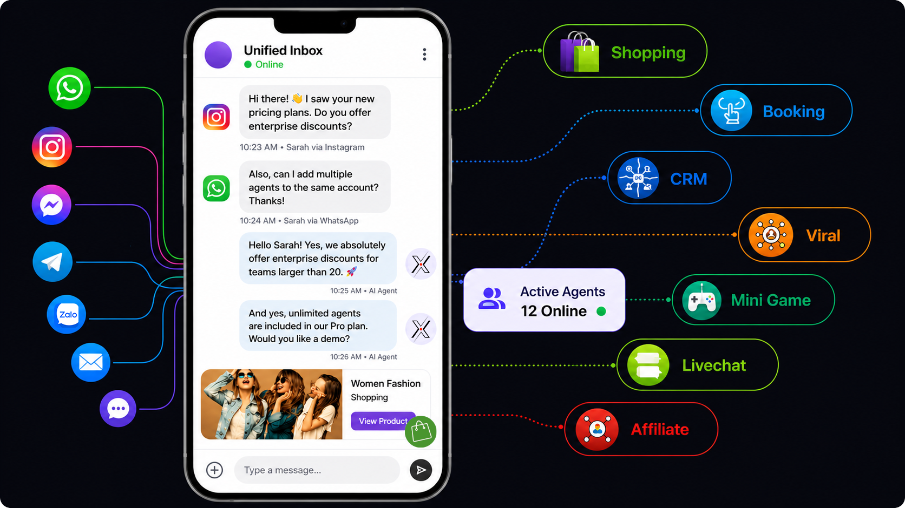
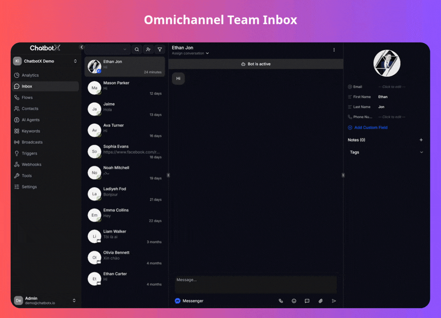
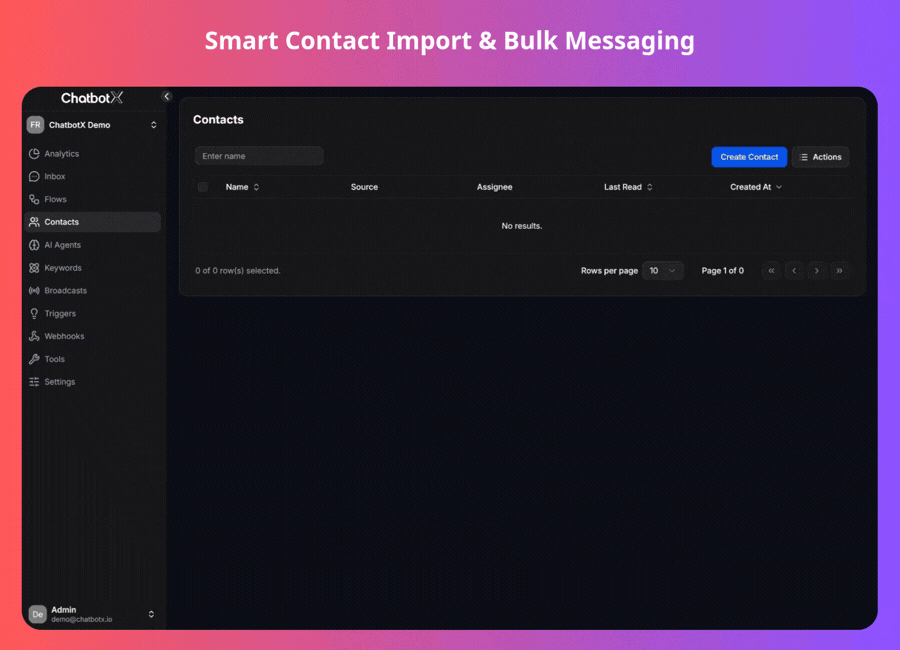
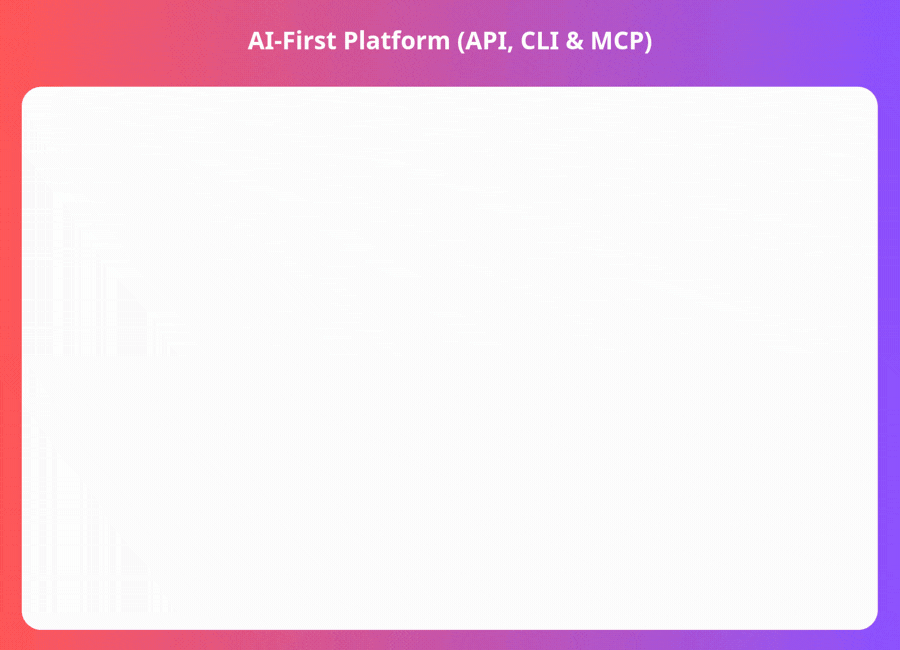
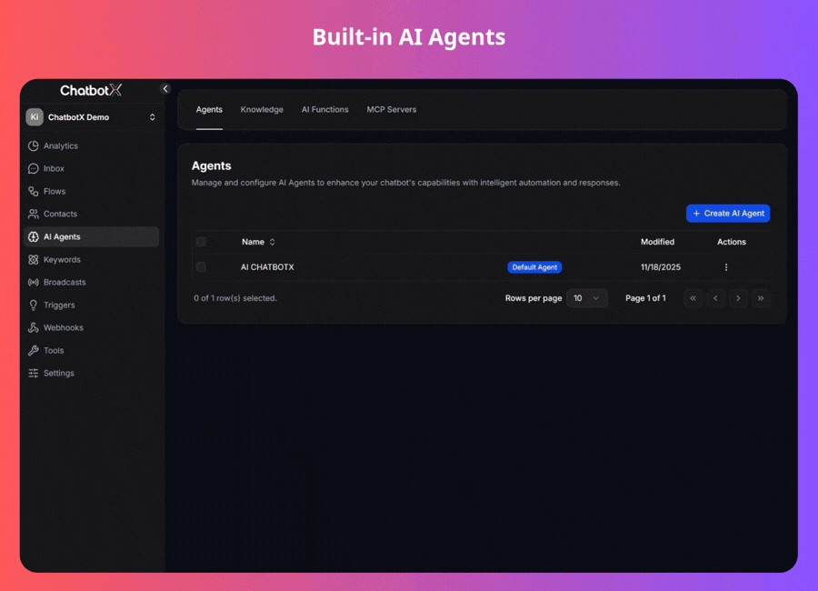

<p align="center">
  <a href="https://github.com/ChatbotXIO/ChatbotX" target="_blank" rel="noopener">
    <picture>
      <source media="(prefers-color-scheme: dark)" srcset=".github/assets/readme/chatbotx-logo-dark.svg">
      <source media="(prefers-color-scheme: light)" srcset=".github/assets/readme/chatbotx-logo-light.svg">
      
    </picture>
  </a>
</p>

<p align="center">
  <a href="https://opensource.org/license/agpl-v3">
    
  </a>
</p>

<p align="center">
  <strong>Open-source omnichannel chatbot for agentic workflows via APIs, CLI, and MCP.</strong>
  <br>
  An alternative to Wati, ManyChat, Chatfuel and Respond.io.
</p>

<p align="center">
  <a href="https://chatbotx.io">Website</a>
  |
  <a href="https://chatbotx.io/coming-soon/">Cloud</a>
  |
  <a href="https://chatbotx.io/docs">Docs</a>
  |
  <a href="https://discord.chatbotx.io/">Discord</a>
</p>

<p align="center">
  
  
  
  
  
  
  
  
</p>

<p align="center">
  
  
  
  
  
  <picture>
    <source media="(prefers-color-scheme: dark)" srcset=".github/assets/readme/tiktok-dark.svg">
    <source media="(prefers-color-scheme: light)" srcset=".github/assets/readme/tiktok-light.svg">
    
  </picture>
  
  
</p>

<p align="center">
  
</p>

## ✨ Features

- **Omnichannel Inbox:** Manage customer conversations from supported messaging channels in one workspace.
- **Flow Builder:** Build automated chatbot flows for qualification, support, routing, follow-up, and data capture.
- **AI Agents:** Connect AI providers and knowledge workflows to answer questions, analyze inputs, generate content, and hand off to humans.
- **Broadcasts and Sequences:** Send campaigns, schedule follow-ups, and track channel-level delivery workflows.
- **Triggers and Webhooks:** React to events and connect ChatbotX with external systems.
- **APIs, CLI, and MCP:** Automate ChatbotX from scripts, agent workflows, and MCP-compatible clients.
- **Integrations:** Includes channel and app integrations such as WhatsApp, Messenger, Instagram, Telegram, Zalo, Webchat, Email, OpenAI, and Google Sheets.

<table width="100%">
  <tr>
    <td width="50%" align="center" valign="top">
      
    </td>
    <td width="50%" align="center" valign="top">
      
    </td>
  </tr>
  <tr>
    <td width="50%" align="center" valign="top">
      
    </td>
    <td width="50%" align="center" valign="top">
      
    </td>
  </tr>
</table>

## Tech Stack

- Node.js 24
- TypeScript 5
- pnpm 10 workspaces
- Turborepo
- Next.js 16 and React 19 for `apps/builder`
- PartyKit / PartySocket for realtime messaging
- Drizzle ORM with PostgreSQL and pgvector
- Redis and BullMQ for queues and worker coordination
- RustFS / S3-compatible storage for uploaded assets
- ClickHouse for analytics
- Docker Compose for local infrastructure

## Quick Start

To have the project up and running, please follow the [Quick Start Guide](https://chatbotx.io/docs/quickstart).

## Project Structure

```text
.
|-- apps/
|   |-- builder/       # Next.js web app and product builder
|   |-- worker/        # background workers for chat, AI, triggers, webhooks, analytics, sequences
|   |-- realtime/      # realtime server
|   |-- cli/           # ChatbotX command line client
|   `-- mcp-server/    # MCP server backed by public APIs
|-- integrations/
|   |-- whatsapp/
|   |-- messenger/
|   |-- instagram/
|   |-- telegram/
|   |-- zalo/
|   |-- webchat/
|   |-- smtp/
|   |-- openai/
|   `-- google-sheets/
|-- packages/
|   |-- database/
|   |-- ai/
|   |-- analytics/
|   |-- public-apis/
|   |-- sdk/
|   |-- scheduler/
|   |-- sequence-scheduler/
|   |-- ui/
|   `-- worker-config/
|-- docker-compose.yml
|-- pnpm-workspace.yaml
`-- turbo.json
```

## Development Commands

```bash
pnpm dev              # run turbo dev
pnpm build            # build all packages/apps through Turborepo
pnpm lint             # run Ultracite lint
pnpm fix              # run Ultracite fix
```

Useful package-level commands:

```bash
pnpm --filter builder dev
pnpm --filter worker dev
pnpm --filter realtime dev
pnpm --filter chatbotx-cli dev:cli
pnpm --filter chatbotx-mcp-server dev:mcp
pnpm --filter @chatbotx.io/database db:studio
```

## Services

The default Docker Compose stack includes:

- PostgreSQL with pgvector on `5432`
- Redis on `6379`
- RedisInsight on `5540`
- RustFS object storage on `9000` and console on `9001`
- MailHog SMTP on `1025` and UI on `8025`
- Adminer on `8080`
- ClickHouse through the included ClickHouse compose file

## License

ChatbotX' Community Edition is released as open source under the [AGPLv3 license](https://github.com/ChatbotXIO/ChatbotX/blob/main/LICENSE) and enterprise features are released under [Commercial License](https://github.com/ChatbotXIO/ChatbotX/blob/main/apps/builder/src/enterprise/LICENSE)
